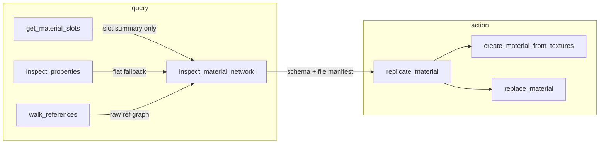

# Material network tools — design spec

**Status:** Implemented for native graph inspect + preview-first clone/remap apply  
**Tools:** `inspect_material_network`, `replicate_material`  
**Motivation:** CC/Octane character work exposed gaps in flat slot inspection and single-file PBR creation. Agents currently fall back to `execute_maxscript` for nested texmap graphs, UDIM tiles, and structure-preserving clones.

---

## Goals

| Principle | Meaning |
|-----------|---------|
| Query before action | `inspect_material_network` is the read path; `replicate_material` consumes its schema |
| Safe by default | Preview/dry-run, explicit assign, path validation, no silent empty maps |
| Renderer-aware | Octane/CC are first-class profiles; core logic works for Physical/OpenPBR/Arnold |
| Compact but complete | Tree output with truncation + stable node IDs, not 199 flat props |
| Native-first | C++ handler for traversal; MAXScript fallback only where PB2/SDK gaps exist |

---

## Relationship to existing tools



**Rule:** Agents should not need `execute_maxscript` for “what maps are wired?” or “copy material A → B with new textures”.

| Existing tool | Keeps doing |
|---------------|-------------|
| `get_material_slots` | Fast flat slot list, truncation by group |
| `inspect_properties` | Full param dump when every param name is needed |
| `walk_references` | Raw SDK ref graph without file/semantic interpretation |
| `create_material_from_textures` | Single-file PBR from folder patterns |
| `replace_material` | Swap material instance by name across objects |
| **`inspect_material_network`** | Semantic wiring diagram + file manifest + health checks |
| **`replicate_material`** | Structure-preserving clone + intelligent remap + verify |

---

# 1. `inspect_material_network`

## Purpose

Return a **semantic material graph**: which slots are wired, through which nodes, to which files — including UDIM tiles, ORM extracts, composites, and SSS/displacement wrappers.

## Parameters

| Param | Type | Default | Notes |
|-------|------|---------|-------|
| `name` | string | required | **Object name OR material name** (resolve both) |
| `sub_material_index` | int | `0` | For multi/sub materials |
| `depth` | int | `3` | Max recursion into texmaps (cap 6) |
| `scope` | enum | `"wired"` | `wired` \| `all_slots` \| `files_only` |
| `include_values` | bool | `true` | Numeric/color/bool on each node |
| `verify_files` | bool | `true` | `doesFileExist` + size; flag stubs (<4KB ORM/metallic) |
| `max_nodes` | int | `80` | Truncation budget |
| `profile` | enum | `"auto"` | `auto` \| `generic` \| `octane` \| `cc_character` |

## Resolution order

1. `getNodeByName(name)` → use `node.material[sub]`
2. Else scan scene for `material.name == name`
3. Clear error: `Not found as object or material: X`

## Output schema (stable contract)

```json
{
  "ok": true,
  "resolvedVia": "object",
  "root": {
    "id": "n0",
    "name": "Anya_Body",
    "class": "Std Surface Mtl",
    "subMaterialIndex": 0,
    "rendererProfile": "octane_standard"
  },
  "wiredSlots": [
    {
      "slot": "baseColor_tex",
      "inputType": 2,
      "nodeId": "n1",
      "role": "base_color"
    }
  ],
  "nodes": [
    {
      "id": "n1",
      "class": "Image_tiles",
      "name": "DiffuseTiles",
      "parentId": "n0",
      "edge": "baseColor_tex",
      "files": [
        {
          "path": "C:\\...\\Std_Skin_Diffuse.1001.jpg",
          "exists": true,
          "bytes": 4484464,
          "udim": 1001
        }
      ],
      "udim": { "gridSize": [6, 1], "tileCount": 6, "valid": true },
      "warnings": [],
      "values": {
        "colorSpace": "_OctaneBuildIn_sRGB",
        "chFormat_comboType": 0
      }
    }
  ],
  "issues": [
    {
      "code": "EMPTY_TILE_LIST",
      "nodeId": "n1",
      "message": "ImageFilenames_list is #(\"\")."
    },
    {
      "code": "PATH_FORMAT",
      "nodeId": "n1",
      "message": "Forward slashes may be cleared by Octane Image_tiles."
    }
  ],
  "truncated": { "nodesOmitted": 0 },
  "hints": {
    "replicateReady": true,
    "textureFolderGuess": "C:\\...\\tex",
    "preset": "cc_octane_skin"
  }
}
```

## Node typing (semantic roles)

Built-in recognizers (extensible table in Python + native):

| Class pattern | Extract |
|---------------|---------|
| `Image_tiles` | `ImageFilenames_list`, `gridSize`, ofsU/V, path-format warning |
| `Image_MTX`, `Bitmaptexture` | `filename` |
| `Extract3_MTX`, `Channel_picker` | `index`, `colorChannel`, `input_tex` |
| `Composite_texture` | `layer_list[]` → child `OtlTexture` blend modes |
| `Texture_displacement` | `amount`, `black_level`, `texture_tex` |
| `OtlTexture` | `blendMode`, `input_value`, `input_tex` |
| `Multimaterial` | Expand subs when `scope=all_slots` |

**Role inference:** slot name + graph shape → `base_color`, `roughness`, `normal`, `sss_color`, `sss_radius`, `displacement`, `opacity`, etc.

## Safety (read-only)

- Blacklist crash props (reuse `inspect_properties` list)
- Cap refs per node (50, same as `walk_references`)
- Never load bitmap pixels into JSON
- Circular refs → `"_circular": true` with class name

## Implementation

| Layer | Work |
|-------|------|
| Native | `native:inspect_material_network`, `native:replicate_material` in `material_network_handlers.cpp` — traverse/clone `Mtl`/`Texmap` PB2 graphs and rewrite file params without MAXScript loops |
| Python | `src/tools/material_network.py` — policy wrapper, preview-default tripback, native-only execution |
| Fallback | Flat `get_material_slots`; graph inspection/replication intentionally requires the native bridge |
| Tests | Mock-native wrapper tests plus native build coverage |

---

# 2. `replicate_material`

## Purpose

Clone a live material graph from source to target, optionally remapping texture paths — without hand-written MAXScript.

Modes:

- **Clone graph** — copy node tree + values (same structure as source)
- **Remap files** — swap paths via folder/pattern/UDIM table (CC workflow)

## Parameters

| Param | Type | Default | Notes |
|-------|------|---------|-------|
| `source` | string | required | Object or material name |
| `target` | string \| list | required | Object(s) to receive copy |
| `source_sub_material_index` | int | `0` | |
| `mode` | enum | `"clone_and_remap"` | See modes below |
| `texture_folder` | string | `""` | Required for remap modes |
| `path_map` | object | null | Explicit `{old: new}` or UDIM table |
| `preset` | enum | `"auto"` | `auto` \| `none` \| `cc_octane_skin` |
| `material_name` | string | `""` | New root material name |
| `assign` | bool | `true` | Assign to target objects |
| `instance_maps` | bool | `false` | Share texmaps vs copy (default copy) |
| `preview` | bool | **`true`** | No scene mutation when true |
| `verify` | bool | `true` | Post-assign readback via inspect network |
| `allow_missing` | bool | `false` | Allow remap when files missing |
| `confirm` | bool | `false` | Required for `remap_in_place` |

### Modes

| Mode | Behavior |
|------|----------|
| `preview` | Plan only; no mutation |
| `clone` | Deep-copy graph; keep original paths |
| `clone_and_remap` | Copy graph + replace file paths |
| `remap_in_place` | Rewrite paths on existing material (`confirm=true`) |
| `preset_cc_octane_skin` | Build from manifest: UDIM tiles, Extract3, composite normal, SSS, displacement |

## Safety model

```
preview=true (default)
  → return replication plan + warnings
  → no material created, no assignment

preview=false + assign=true
  → requires:
      - source network inspect OK (replicateReady)
      - all remapped files exist (unless allow_missing)
      - no EMPTY_TILE_LIST / invalid UDIM grid
  → optional undo label: "MCP replicate_material"
```

| Guard | Why |
|-------|-----|
| Default `preview=true` | Prevents accidental mass assign |
| File existence check | Catches empty Octane tiles |
| Path normalization | Always Windows backslashes for Octane `Image_tiles` |
| Extension validation | JPEG-as-PNG warning; optional auto-fix |
| `remap_in_place` gated | Requires `confirm=true` + single target |
| No delete of source material | Ever |
| Tripback includes verification diff | Agent can confirm maps loaded |

## Replication algorithm

### Phase A — Inspect source

Internal `inspect_material_network(source)` → **ReplicationManifest**:

```json
{
  "preset": "cc_octane_skin",
  "rootClass": "Std_Surface_Mtl",
  "nodes": [],
  "fileBindings": [
    {
      "nodeId": "n1",
      "prop": "ImageFilenames_list",
      "pattern": "Std_Skin_Diffuse.{udim}.jpg"
    }
  ],
  "scalarBindings": [
    { "nodeId": "n0", "prop": "subsurface_value", "value": 1.0 }
  ]
}
```

### Phase B — Plan remap

When `texture_folder` is set:

- Reuse `material_detection` + new **UDIM grouper** (`*.1001` … `*.1006`)
- CC profile: Head/Body/Arm/Leg/Nails/Eyelash → tile index
- ORM synthesis: pack AO+roughness when ORM missing/stub
- Output `plannedFiles[]` with exists/size

### Phase C — Execute (`preview=false`)

1. Clone via SDK / MAXScript (renderer-dependent; test per class)
2. Walk manifest nodes; set PB2 values + texmap refs in dependency order
3. Apply path remaps on clone only
4. Assign to targets (whole material or `set_sub_material` if sub index set)
5. Optional: place in MEDit slot (`medit_slot` param)
6. Verify — re-inspect target; report failure if tile count/grid wrong

### Phase D — Tripback

```json
{
  "ok": true,
  "preview": false,
  "materialName": "Anya_Body",
  "assignedTo": ["CC_Base_Body"],
  "remappedFiles": 24,
  "warnings": ["Eyelash UDIM 1006 uses head normal fallback"],
  "verification": {
    "baseColor_tileCount": 6,
    "allFilesExist": true
  },
  "hint": "Save scene to persist paths"
}
```

## Preset: `cc_octane_skin`

Encodes the CC character body workflow (Octane Std Surface):

| Component | Template |
|-----------|----------|
| Diffuse / SSS color | `Image_tiles` N×1, sRGB |
| Roughness | `Extract3_MTX` index 1 on ORM tiles |
| Normal | `Composite_texture` 3× `OtlTexture` (macro + MicroN + macro) |
| Displacement | `Texture_displacement` wrapper |
| SSS | subsurface, scale, anisotropy, radius color + map |
| Paths | `@\"C:\\...\"` backslashes only for `Image_tiles` |

Preset is **data-driven** (`src/material_presets/cc_octane_skin.json`), not a one-off MAXScript string.

---

# 3. Shared infrastructure

## Modules

```
src/tools/material_network.py       # inspect_material_network + replicate_material
native/src/handlers/material_network_handlers.cpp
```

Future preset synthesis can add `src/material_network/` helpers and
`src/material_presets/cc_octane_skin.json`. The shipped P0/P1 path keeps the
working contract small: inspect, preview, clone/remap, assign, verify.

## Native commands

| Command | Priority |
|---------|----------|
| `native:inspect_material_network` | P0 |
| `native:replicate_material` | P0/P1 |

`native:replicate_material` branches on `preview`; the older preview/apply native handlers remain internal compatibility routes.

---

# 4. Phased rollout

| Phase | Deliverable | Risk |
|-------|-------------|------|
| **P0** | `inspect_material_network` — resolve object/material, wired tree, file verify, Octane/Image_tiles | Low (read-only) |
| **P1** | `replicate_material` preview + `clone` mode (no remap) | Low |
| **P2** | Remap + UDIM grouper + path normalization | Medium |
| **P3** | `cc_octane_skin` preset + ORM pack + verify tripback | Medium |
| **P4** | Multi-mat consolidate (`consolidate_to_udim=true`) | Higher |

Ship **P0 + P1** together so agents can inspect → preview clone before file IO.

---

# 5. Test plan

| Test | Covers |
|------|--------|
| Resolve object vs material name | `CC_Base_Body` vs `Anya_Body` |
| Empty tile detection | `#("")` → `EMPTY_TILE_LIST` |
| Forward vs backslash paths | Warning + replicate normalizes |
| JPEG mislabeled `.png` | `EXTENSION_MISMATCH` warning |
| Truncation at `max_nodes` | Stable `truncated` block |
| `preview=true` | Zero scene diff |
| Clone Physical → Physical | Baseline |
| Clone Octane Std Surface + Image_tiles | CC fixture |
| Remap 6 UDIM tiles | All exists in verify |
| Failed verify | No silent bad assign |

---

# 6. Example agent workflow

```text
1. inspect_material_network("CC_Base_Body", scope="wired", verify_files=true)
   → preset=cc_octane_skin, textureFolderGuess

2. replicate_material(
     source="CC_Base_Body",
     target="CC_Base_Body_New",
     texture_folder="C:/.../Export/1/tex",
     preset="cc_octane_skin",
     preview=true
   )
   → review plannedFiles, warnings

3. replicate_material(..., preview=false, assign=true, verify=true)
   → capture_viewport
```

---

# 7. Known pitfalls (from production use)

Document in SKILL when implemented:

- Octane `Image_tiles`: set `ImageFilenames_list` with `@\"C:\\path\\file.jpg\"` — forward slashes can persist as `#("")` / 1×1 grid
- Set `gridSize` before `ImageFilenames_list`; verify readback count/grid after assign
- CC FBX `*_Metallic.jpg` in `.fbm` is often a stub; prefer `textures/...` AO+roughness or packed ORM
- CC normals may be JPEG bytes; do not use `.png` extension unless file is actually PNG
- Save scene after replicate — unsaved reload can drop path assignments

---

# 8. Issue codes (inspect)

| Code | Meaning |
|------|---------|
| `EMPTY_TILE_LIST` | Image_tiles has blank or single empty path |
| `PATH_FORMAT` | Suspect path separator for Octane tiles |
| `FILE_MISSING` | Path set but `doesFileExist` false |
| `STUB_TEXTURE` | File exists but suspiciously small (ORM/metallic) |
| `EXTENSION_MISMATCH` | Magic bytes disagree with extension |
| `UDIM_GRID_MISMATCH` | Tile count vs gridSize inconsistent |
| `UNWIRED_SLOT` | Material slot has input_type for map but no texmap |
